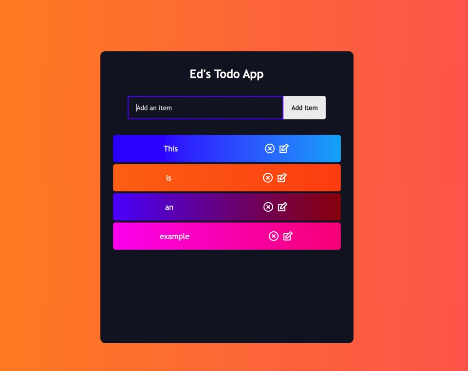

Todo List

This is a frontend mininal viable product todo app in which the user can create, delete, cross off, and update an action item. This was made with HTML, CSS , and JS as the primary languages and React's library.

Challenges:

I faced a few challenges. One of the chanllenges I faced was concept of passing down a Prop from TodoFrom.js to Form.js. It took time for me to realize that props are passed down as an object that can be deconstructed. The deconstructions can be seen in row 8 of Todo.js. Another challenge was with styling. I was unable to figure out why I cannot override the first button's background even though I made changes targeting its className.

References and sources for help:
Youtube - Brian Design - React Todo List App tutorials

General Assembly - Teacher Assistance
